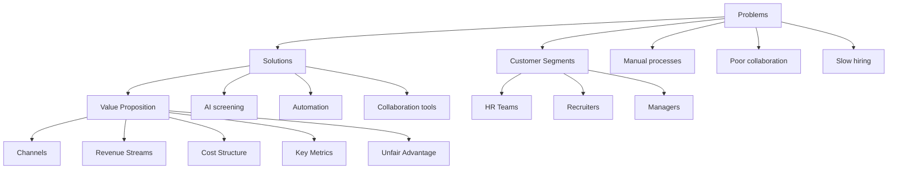
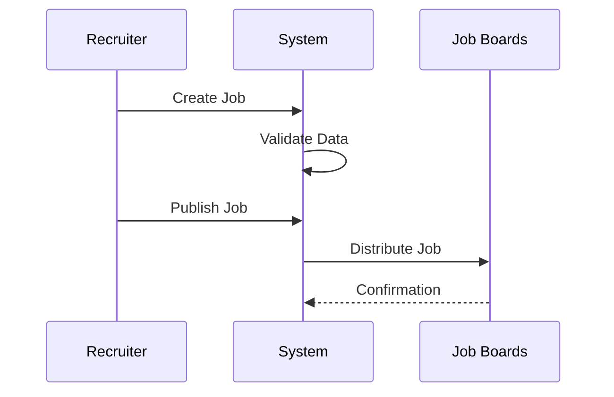
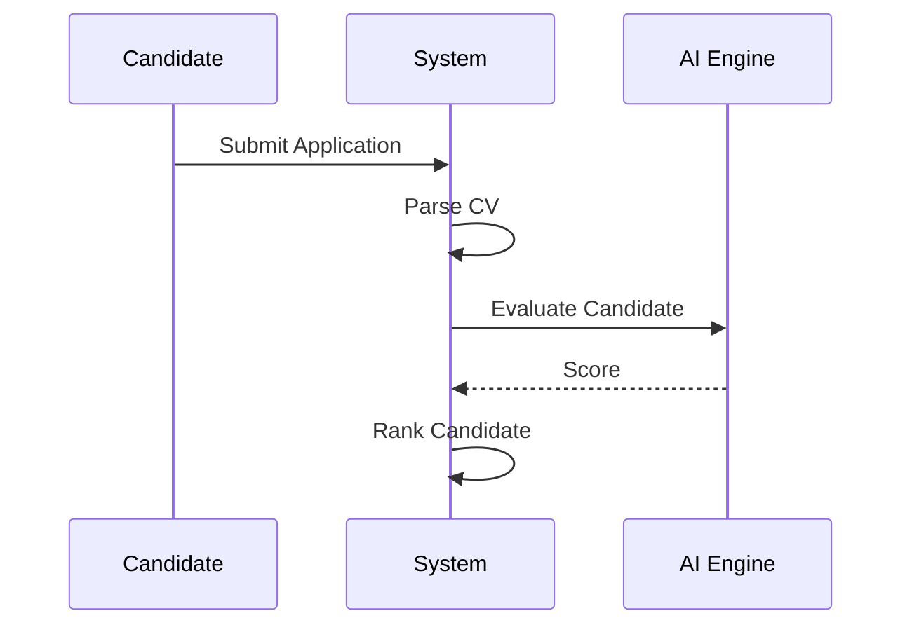
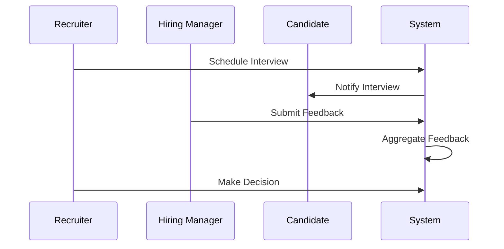
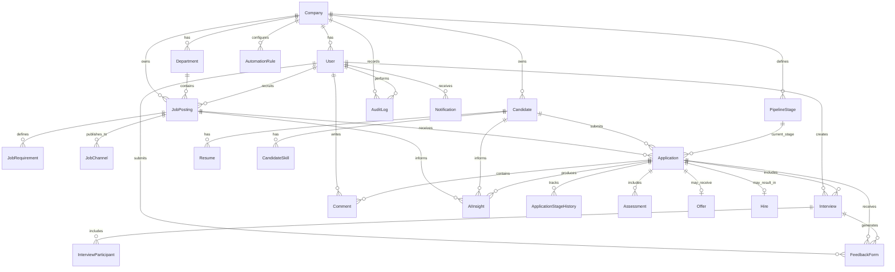
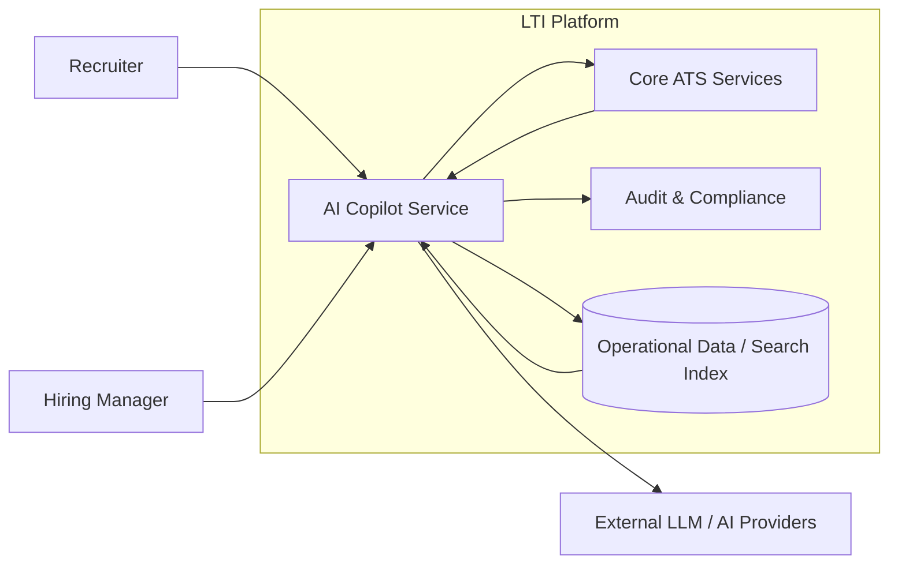
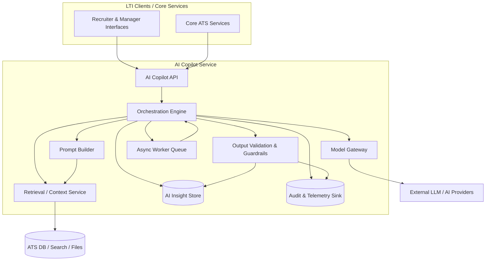
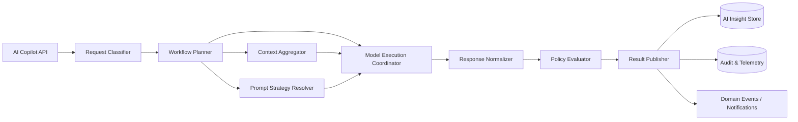

# LTI ATS - Research & Analysis

## 1. Core Functionalities (Prioritized)

### 1. Job Creation & Management (Critical)
- Create, edit, and manage job postings
- Define requirements, salary range, location, skills
- Templates for recurring roles
- Versioning of job descriptions

### 2. Candidate Application Management (Critical)
- Receive applications from multiple channels
- Centralized candidate database
- Resume parsing (CV → structured data)
- Candidate profile enrichment

### 3. Recruitment Pipeline Management (Critical)
- Visual pipeline (Kanban-style)
- Stages tracking
- Drag & drop progression
- Status history

### 4. Collaboration & Feedback System (High)
- Comments and notes
- Shared evaluation forms
- Role-based access
- Real-time collaboration

### 5. AI-Powered Assistance (High)
- CV screening & ranking
- Candidate summaries
- Interview question generation
- Bias detection
- Email drafting

### 6. Interview Management (High)
- Scheduling
- Interview kits
- Feedback consolidation

### 7. Online Assessments (Medium-High)
- Technical tests
- Automated grading
- External integrations

### 8. Multi-channel Job Publishing (Medium)
- Job boards integration
- Social media
- Career page

### 9. Automation & Workflows (Medium)
- Rules-based automation
- Email triggers
- SLA tracking

### 10. Analytics & Reporting (Medium)
- Time-to-hire
- Funnel metrics
- Source tracking

### 11. Compliance & Data Privacy (Medium)
- GDPR
- Consent management
- Data anonymization

---

## 2. Benefits

### For Candidates
- Faster process
- Better communication
- Fair evaluation
- Personalized experience
- Easy applications

### For Recruiters
- Efficiency
- Better decisions
- Collaboration
- Higher quality hires
- Scalability

### For Hiring Managers
- Visibility
- Structured evaluations
- Less coordination overhead

---

## 3. Alternatives

### Manual Recruitment
- Excel, email
- Good for small companies
- Not scalable

### Job Boards Only
- Simple hiring needs
- No pipeline management

### Recruitment Agencies
- Useful for complex roles
- Expensive

### Legacy ATS
- Enterprise use
- Poor UX, low flexibility

### CRM-based Hiring
- Custom workflows
- Not specialized

---

## Key Insight

LTI should be an AI-native recruitment operating system:
- AI-first workflows
- Real-time collaboration
- Automation-first
- Great UX
- Integration-ready

# LTI ATS - Product Definition & Lean Canvas

## 1.1 Product Description

LTI is an AI-native Applicant Tracking System designed to optimize and automate the entire recruitment lifecycle. Unlike traditional ATS platforms, LTI integrates artificial intelligence at its core to enhance decision-making, reduce manual effort, and improve collaboration between HR teams and hiring managers.

### Value Proposition
- Reduce time-to-hire through automation and AI-assisted screening
- Improve candidate quality with intelligent ranking and matching
- Enable real-time collaboration across stakeholders
- Deliver a superior candidate experience
- Provide actionable insights through analytics

### Competitive Advantages
- AI-first architecture (not an add-on)
- Real-time collaborative workflows
- Automation-driven pipeline management
- Modern UX compared to legacy ATS
- Integration-first ecosystem

---

## 1.2 Lean Canvas

### Problem
- Manual and inefficient recruitment processes
- Poor collaboration between HR and hiring managers
- High time-to-hire
- Candidate drop-off due to poor experience
- Bias in candidate evaluation

### Customer Segments
- HR teams
- Recruiters
- Hiring managers
- Medium to large companies (primary)
- Startups scaling hiring (secondary)

### Unique Value Proposition
AI-native recruitment platform that automates hiring, improves collaboration, and delivers better candidates faster.

### Solution
- AI-powered candidate screening
- Automated workflows
- Centralized recruitment pipeline
- Real-time collaboration tools
- Integrated interview and assessment tools

### Channels
- SaaS platform (web app)
- Integrations (LinkedIn, job boards)
- Direct sales (B2B)
- Partnerships (HR tools ecosystem)

### Revenue Streams
- Subscription (SaaS tiers)
- Pay-per-hire features
- Premium AI features
- Enterprise licensing

### Cost Structure
- Cloud infrastructure
- AI/ML development and inference
- Engineering and product teams
- Sales and marketing
- Customer support

### Key Metrics
- Time-to-hire
- Cost-per-hire
- Candidate conversion rates
- User engagement
- Customer retention

### Unfair Advantage
- AI deeply embedded in workflows
- Data network effects (better models over time)
- Superior UX vs competitors
- Strong integrations ecosystem

---

## 1.3 Lean Canvas Diagram (Mermaid)



# LTI ATS - Main Use Cases

## Use Case 1: Create and Publish a Job

### Description
A recruiter creates a job position and publishes it across multiple channels.

### Actors
- Recruiter
- System

### Flow
1. Recruiter creates a job
2. System validates input
3. Recruiter publishes job
4. System distributes to channels
5. Job becomes visible to candidates

### Diagram


---

## Use Case 2: Candidate Application & Screening

### Description
Candidates apply to a job and the system evaluates them using AI.

### Actors
- Candidate
- System

### Flow
1. Candidate submits application
2. System parses CV
3. AI evaluates candidate
4. Candidate is ranked
5. Recruiter reviews shortlist

### Diagram


---

## Use Case 3: Interview & Hiring Decision

### Description
Candidates go through interviews and a hiring decision is made.

### Actors
- Recruiter
- Hiring Manager
- Candidate
- System

### Flow
1. Recruiter schedules interview
2. Candidate attends interview
3. Interviewers submit feedback
4. System aggregates feedback
5. Decision is made

### Diagram


# LTI ATS - Data Model

## 3. Data Model

This data model covers the core entities required for an AI-native Applicant Tracking System (ATS). It is designed to support the full hiring lifecycle: job creation, candidate sourcing, application tracking, interviews, assessments, collaboration, automation, and hiring decisions.

---

## 3.1 Design Principles

- **Separation of concerns**: candidate, job, pipeline, interview, and AI-related data are modeled independently.
- **Traceability**: every important state change should be auditable.
- **Extensibility**: the model allows integrations, automation rules, and AI-generated artifacts.
- **Collaboration-first**: comments, scorecards, and decisions are first-class entities.
- **Compliance-aware**: consent, retention, and privacy-sensitive data can be managed explicitly.

---

## 3.2 Core Entities and Attributes

## 1. Company
Represents the customer organization using LTI.

| Attribute | Type | Description |
|---|---|---|
| id | UUID | Unique identifier |
| name | String | Company name |
| industry | String | Industry sector |
| size | Integer | Estimated employee count |
| websiteUrl | String | Corporate website |
| createdAt | DateTime | Record creation timestamp |
| updatedAt | DateTime | Last update timestamp |

---

## 2. User
Represents an authenticated platform user.

| Attribute | Type | Description |
|---|---|---|
| id | UUID | Unique identifier |
| companyId | UUID | Owning company |
| firstName | String | First name |
| lastName | String | Last name |
| email | String | Work email |
| role | Enum | Recruiter, HiringManager, Interviewer, Admin |
| status | Enum | Active, Invited, Disabled |
| createdAt | DateTime | Record creation timestamp |
| updatedAt | DateTime | Last update timestamp |

---

## 3. Department
Represents the internal department that owns a role.

| Attribute | Type | Description |
|---|---|---|
| id | UUID | Unique identifier |
| companyId | UUID | Owning company |
| name | String | Department name |
| createdAt | DateTime | Record creation timestamp |

---

## 4. JobPosting
Represents an open role to be filled.

| Attribute | Type | Description |
|---|---|---|
| id | UUID | Unique identifier |
| companyId | UUID | Owning company |
| departmentId | UUID | Department owning the role |
| hiringManagerId | UUID | Responsible manager |
| recruiterId | UUID | Responsible recruiter |
| title | String | Job title |
| description | Text | Full job description |
| employmentType | Enum | FullTime, PartTime, Contract, Internship |
| locationType | Enum | Onsite, Hybrid, Remote |
| location | String | City / country / region |
| salaryMin | Decimal | Lower range |
| salaryMax | Decimal | Upper range |
| currency | String | Salary currency |
| status | Enum | Draft, Published, Paused, Closed, Filled |
| publishedAt | DateTime | Publication timestamp |
| closesAt | DateTime | Optional closing date |
| createdAt | DateTime | Record creation timestamp |
| updatedAt | DateTime | Last update timestamp |

---

## 5. JobRequirement
Represents a structured requirement attached to a job.

| Attribute | Type | Description |
|---|---|---|
| id | UUID | Unique identifier |
| jobPostingId | UUID | Related job |
| type | Enum | Skill, Experience, Education, Certification, Language |
| value | String | Requirement value |
| priority | Enum | MustHave, NiceToHave |
| createdAt | DateTime | Record creation timestamp |

---

## 6. JobChannel
Represents a publication destination for a job.

| Attribute | Type | Description |
|---|---|---|
| id | UUID | Unique identifier |
| jobPostingId | UUID | Related job |
| channelType | Enum | CareerSite, LinkedIn, Indeed, ReferralPortal, ExternalAPI |
| externalReference | String | Channel-side ID |
| publicationStatus | Enum | Pending, Published, Failed, Removed |
| publishedAt | DateTime | Publication timestamp |

---

## 7. Candidate
Represents a person who may apply to one or more jobs.

| Attribute | Type | Description |
|---|---|---|
| id | UUID | Unique identifier |
| companyId | UUID | Owning company tenant |
| firstName | String | First name |
| lastName | String | Last name |
| email | String | Primary email |
| phone | String | Phone number |
| currentTitle | String | Current role |
| currentCompany | String | Current employer |
| location | String | Candidate location |
| linkedInUrl | String | LinkedIn profile |
| githubUrl | String | GitHub profile |
| portfolioUrl | String | Portfolio / personal site |
| summary | Text | Candidate summary |
| source | Enum | CareerSite, LinkedIn, Referral, Agency, Import, JobBoard |
| status | Enum | Active, Withdrawn, Hired, Archived |
| createdAt | DateTime | Record creation timestamp |
| updatedAt | DateTime | Last update timestamp |

---

## 8. Resume
Represents one uploaded resume/CV version.

| Attribute | Type | Description |
|---|---|---|
| id | UUID | Unique identifier |
| candidateId | UUID | Related candidate |
| fileUrl | String | Storage location |
| originalFileName | String | Uploaded filename |
| parsedText | Text | Extracted text |
| parserVersion | String | Resume parser version |
| uploadedAt | DateTime | Upload timestamp |

---

## 9. CandidateSkill
Represents normalized candidate skills.

| Attribute | Type | Description |
|---|---|---|
| id | UUID | Unique identifier |
| candidateId | UUID | Related candidate |
| name | String | Skill name |
| proficiencyLevel | Enum | Beginner, Intermediate, Advanced, Expert |
| yearsOfExperience | Decimal | Optional duration |
| source | Enum | ParsedCV, UserEntered, RecruiterAdded, AIInferred |

---

## 10. Application
Represents a candidate applying to a specific job.

| Attribute | Type | Description |
|---|---|---|
| id | UUID | Unique identifier |
| candidateId | UUID | Applicant |
| jobPostingId | UUID | Applied job |
| appliedAt | DateTime | Submission timestamp |
| sourceChannel | Enum | CareerSite, LinkedIn, Referral, Agency, JobBoard |
| status | Enum | Submitted, InReview, Rejected, Withdrawn, OfferExtended, Hired |
| currentStageId | UUID | Current pipeline stage |
| coverLetter | Text | Optional cover letter |
| consentAccepted | Boolean | Privacy consent flag |
| consentAcceptedAt | DateTime | Timestamp of consent |
| createdAt | DateTime | Record creation timestamp |
| updatedAt | DateTime | Last update timestamp |

---

## 11. PipelineStage
Represents a reusable stage in a hiring pipeline.

| Attribute | Type | Description |
|---|---|---|
| id | UUID | Unique identifier |
| companyId | UUID | Owning company |
| name | String | Stage name |
| category | Enum | Screening, Assessment, Interview, Offer, Hired, Rejected |
| displayOrder | Integer | UI ordering |
| isTerminal | Boolean | Whether stage ends process |
| createdAt | DateTime | Record creation timestamp |

---

## 12. ApplicationStageHistory
Tracks movement of an application through the pipeline.

| Attribute | Type | Description |
|---|---|---|
| id | UUID | Unique identifier |
| applicationId | UUID | Related application |
| fromStageId | UUID | Previous stage |
| toStageId | UUID | New stage |
| changedByUserId | UUID | Actor who changed stage |
| reason | String | Optional explanation |
| changedAt | DateTime | Transition timestamp |

---

## 13. Assessment
Represents a test assigned to an applicant.

| Attribute | Type | Description |
|---|---|---|
| id | UUID | Unique identifier |
| applicationId | UUID | Related application |
| type | Enum | CodingTest, Quiz, Assignment, Psychometric |
| provider | String | Internal or external provider |
| status | Enum | Pending, Sent, Completed, Expired, Reviewed |
| score | Decimal | Numeric result |
| maxScore | Decimal | Maximum possible score |
| assignedAt | DateTime | Assignment timestamp |
| completedAt | DateTime | Completion timestamp |

---

## 14. Interview
Represents a scheduled interview event.

| Attribute | Type | Description |
|---|---|---|
| id | UUID | Unique identifier |
| applicationId | UUID | Related application |
| interviewType | Enum | PhoneScreen, Technical, Behavioral, Panel, Final |
| scheduledStart | DateTime | Start datetime |
| scheduledEnd | DateTime | End datetime |
| timezone | String | Timezone |
| meetingUrl | String | Video meeting link |
| status | Enum | Scheduled, Completed, Cancelled, NoShow |
| createdByUserId | UUID | Scheduler |
| createdAt | DateTime | Record creation timestamp |

---

## 15. InterviewParticipant
Links users to an interview.

| Attribute | Type | Description |
|---|---|---|
| id | UUID | Unique identifier |
| interviewId | UUID | Related interview |
| userId | UUID | Participant user |
| role | Enum | Interviewer, Observer, Coordinator |

---

## 16. FeedbackForm
Represents structured evaluation submitted after an interview or review.

| Attribute | Type | Description |
|---|---|---|
| id | UUID | Unique identifier |
| applicationId | UUID | Related application |
| interviewId | UUID | Optional linked interview |
| submittedByUserId | UUID | Reviewer |
| recommendation | Enum | StrongReject, Reject, Neutral, Hire, StrongHire |
| score | Decimal | Overall score |
| strengths | Text | Positive notes |
| concerns | Text | Risks / concerns |
| submittedAt | DateTime | Submission timestamp |

---

## 17. Comment
Represents collaboration comments attached to an application.

| Attribute | Type | Description |
|---|---|---|
| id | UUID | Unique identifier |
| applicationId | UUID | Related application |
| authorUserId | UUID | Author |
| body | Text | Comment content |
| visibility | Enum | Internal, Restricted |
| createdAt | DateTime | Creation timestamp |

---

## 18. Offer
Represents an offer extended to a candidate.

| Attribute | Type | Description |
|---|---|---|
| id | UUID | Unique identifier |
| applicationId | UUID | Related application |
| status | Enum | Draft, Sent, Accepted, Declined, Expired |
| salaryAmount | Decimal | Offered compensation |
| currency | String | Currency |
| startDate | Date | Proposed start date |
| expiresAt | DateTime | Offer expiration |
| sentAt | DateTime | Sent timestamp |
| respondedAt | DateTime | Candidate response timestamp |

---

## 19. Hire
Represents a completed hire event.

| Attribute | Type | Description |
|---|---|---|
| id | UUID | Unique identifier |
| applicationId | UUID | Winning application |
| hiredAt | DateTime | Hire timestamp |
| employeeIdentifier | String | External HRIS ID |
| onboardingStatus | Enum | Pending, InProgress, Completed |

---

## 20. AutomationRule
Represents configurable workflow automation.

| Attribute | Type | Description |
|---|---|---|
| id | UUID | Unique identifier |
| companyId | UUID | Owning company |
| name | String | Rule name |
| triggerType | Enum | ApplicationCreated, StageChanged, AssessmentCompleted, InterviewCompleted |
| conditionExpression | Text | Rule condition |
| actionType | Enum | SendEmail, MoveStage, AssignUser, CreateTask, TriggerWebhook |
| actionPayload | JSON | Action configuration |
| isActive | Boolean | Whether rule is enabled |
| createdAt | DateTime | Record creation timestamp |

---

## 21. AIInsight
Represents AI-generated outputs associated with an application or candidate.

| Attribute | Type | Description |
|---|---|---|
| id | UUID | Unique identifier |
| applicationId | UUID | Related application |
| candidateId | UUID | Related candidate |
| jobPostingId | UUID | Related job |
| insightType | Enum | MatchScore, Summary, SkillGap, InterviewQuestions, RiskFlag, BiasCheck |
| content | JSON | Structured result payload |
| modelName | String | Model identifier |
| confidenceScore | Decimal | Confidence level |
| generatedAt | DateTime | Generation timestamp |
| generatedBy | Enum | System, UserRequested |

---

## 22. Notification
Represents messages sent by the system.

| Attribute | Type | Description |
|---|---|---|
| id | UUID | Unique identifier |
| userId | UUID | Recipient user |
| channel | Enum | Email, InApp, SMS, Webhook |
| templateName | String | Notification template |
| payload | JSON | Render data |
| status | Enum | Pending, Sent, Failed, Read |
| createdAt | DateTime | Record creation timestamp |
| sentAt | DateTime | Sent timestamp |

---

## 23. AuditLog
Tracks important actions for traceability and compliance.

| Attribute | Type | Description |
|---|---|---|
| id | UUID | Unique identifier |
| companyId | UUID | Owning company |
| actorUserId | UUID | User who performed action |
| entityType | String | Affected entity name |
| entityId | UUID | Affected entity ID |
| action | String | Performed action |
| oldValue | JSON | Previous value |
| newValue | JSON | New value |
| createdAt | DateTime | Event timestamp |

---

## 3.3 Main Relationships

- A **Company** has many **Users**, **Departments**, **JobPostings**, **Candidates**, **PipelineStages**, **AutomationRules**, and **AuditLogs**.
- A **Department** has many **JobPostings**.
- A **JobPosting** belongs to one **Company**, one **Department**, one **Recruiter**, and one **Hiring Manager**.
- A **JobPosting** has many **JobRequirements**, **JobChannels**, **Applications**, and **AIInsights**.
- A **Candidate** belongs to one **Company** and has many **Resumes**, **CandidateSkills**, **Applications**, and **AIInsights**.
- An **Application** belongs to one **Candidate** and one **JobPosting**.
- An **Application** has one current **PipelineStage** and many **ApplicationStageHistory** entries.
- An **Application** has many **Assessments**, **Interviews**, **FeedbackForms**, **Comments**, **AIInsights**, and optionally one **Offer** and one **Hire**.
- An **Interview** has many **InterviewParticipants** and may have many **FeedbackForms**.
- A **User** can create **Comments**, **FeedbackForms**, **Interviews**, and **AuditLogs**.
- **AutomationRules** may act on **Applications**, **Interviews**, or **Assessments**.
- **Notifications** are sent to **Users**.
- **AuditLogs** can track changes on any important entity.

---

## 3.4 Recommended Enumerations

### UserRole
- Recruiter
- HiringManager
- Interviewer
- Admin

### JobStatus
- Draft
- Published
- Paused
- Closed
- Filled

### ApplicationStatus
- Submitted
- InReview
- Rejected
- Withdrawn
- OfferExtended
- Hired

### InterviewStatus
- Scheduled
- Completed
- Cancelled
- NoShow

### OfferStatus
- Draft
- Sent
- Accepted
- Declined
- Expired

### AIInsightType
- MatchScore
- Summary
- SkillGap
- InterviewQuestions
- RiskFlag
- BiasCheck

---

## 3.5 Mermaid ER Diagram



---

## 3.6 Notes for Future Technical Design

- **Candidate** and **Application** should remain separate, because one candidate may apply to multiple jobs.
- **PipelineStage** should be reusable at company level, while **ApplicationStageHistory** stores the real execution trail.
- **AIInsight** should be generic and extensible, so new AI features can be added without redesigning the schema.
- **AuditLog** is essential for enterprise adoption and compliance.
- **AutomationRule** should not be hardcoded in the data model; it should be configurable and event-driven.

# LTI ATS - High-Level System Design

## 4.1 High-Level System Design

LTI is designed as an **AI-native, cloud-based, multi-tenant recruitment platform**.  
Its architecture must support the full hiring lifecycle while remaining scalable, secure, extensible, and observable.

The high-level design is based on the following principles:

- **Modular domain-oriented architecture**
- **API-first integration model**
- **Event-driven automation**
- **AI as a core capability**
- **Multi-tenant SaaS foundation**
- **Strong auditability and compliance support**

---

## 4.1.1 High-Level Goals

The architecture must enable LTI to:

1. Support recruiters, hiring managers, interviewers, and candidates through dedicated experiences
2. Manage the full recruitment lifecycle from job creation to hiring
3. Integrate with external job boards, calendars, email systems, assessment providers, and HR systems
4. Provide AI-powered capabilities such as screening, summarization, interview support, and recommendation
5. Execute workflow automations in response to system events
6. Ensure security, traceability, and tenant isolation
7. Scale independently by workload domain

---

## 4.1.2 Main Architectural Building Blocks

## 1. Client Applications
These are the entry points to the platform.

### Recruiter Web App
Used by recruiters and HR teams to:
- create jobs
- manage candidates
- move applications through the pipeline
- review AI suggestions
- trigger workflows
- send communications

### Hiring Manager Portal
Used by hiring managers to:
- review shortlisted candidates
- collaborate with recruiters
- provide interview feedback
- approve offers and decisions

### Interviewer Workspace
Used by interviewers to:
- access interview schedules
- review candidate context
- submit structured scorecards

### Candidate Portal
Used by candidates to:
- browse jobs
- apply to positions
- upload resumes
- track application status
- complete assessments
- schedule interviews when enabled

---

## 2. API Gateway / Backend-for-Frontend Layer
The platform exposes a unified API layer that:
- authenticates users
- routes requests to internal services
- enforces authorization rules
- aggregates data for UI clients
- supports tenant-aware access control

This layer can be implemented as:
- a single modular backend for an MVP, or
- a gateway plus domain services for scale

---

## 3. Core Domain Services

### Job Service
Responsible for:
- job creation and editing
- publication lifecycle
- job requirements
- publishing to job channels

### Candidate Service
Responsible for:
- candidate profiles
- resumes
- profile enrichment
- skill normalization

### Application Service
Responsible for:
- applications
- pipeline stages
- status transitions
- audit history

### Interview Service
Responsible for:
- interview scheduling
- participant management
- scorecards and feedback

### Assessment Service
Responsible for:
- assessment assignment
- result ingestion
- provider integrations

### Offer & Hiring Service
Responsible for:
- offers
- acceptance/decline tracking
- final hiring state
- HRIS handoff

### Collaboration Service
Responsible for:
- comments
- notifications
- activity feeds
- shared review context

### Automation Service
Responsible for:
- event subscription
- workflow rules
- action execution
- background jobs

### AI Copilot Service
Responsible for:
- CV parsing orchestration
- candidate-job matching
- summaries
- interview question generation
- ranking and recommendations
- bias and consistency checks

---

## 4. Data and Storage Layer

### Transactional Database
Stores core business entities:
- companies
- users
- job postings
- candidates
- applications
- interviews
- offers
- automation rules

Typical choice:
- PostgreSQL or another relational database

### Object Storage
Stores files such as:
- resumes
- attachments
- exported reports
- generated artifacts

Typical choice:
- S3-compatible object storage

### Search Index
Supports:
- candidate search
- job search
- skill-based filtering
- full-text retrieval

Typical choice:
- Elasticsearch / OpenSearch

### Analytics / Reporting Store
Used for:
- dashboards
- KPIs
- time-to-hire analysis
- funnel conversion analysis

Could be implemented through:
- read replicas
- warehouse sync
- OLAP layer

### Audit & Event Store
Stores:
- domain events
- important state changes
- compliance records
- workflow traces

---

## 5. Integration Layer

LTI must connect to external systems, including:

- job boards
- LinkedIn / sourcing channels
- email providers
- calendar systems
- assessment vendors
- HRIS / onboarding systems
- messaging/webhook consumers

This integration layer should be implemented with:
- connector adapters
- webhook handlers
- scheduled sync jobs
- retry and dead-letter mechanisms

---

## 6. Event Bus / Async Processing Layer

Many ATS actions are naturally asynchronous, such as:
- sending notifications
- parsing resumes
- generating AI insights
- publishing jobs externally
- running workflow automations
- syncing with providers

An event-driven backbone improves:
- scalability
- decoupling
- resilience
- extensibility

Typical events:
- `JobPublished`
- `ApplicationSubmitted`
- `ResumeUploaded`
- `StageChanged`
- `InterviewCompleted`
- `AssessmentCompleted`
- `OfferAccepted`

---

## 7. Security & Platform Services

### Identity and Access Management
- authentication
- SSO / OAuth / SAML
- role-based authorization
- tenant-aware isolation

### Observability
- logs
- metrics
- traces
- alerting

### Compliance Controls
- consent tracking
- retention policies
- audit logs
- privacy controls

### Configuration & Feature Flags
- tenant-specific settings
- staged feature rollout
- premium AI enablement

---

## 4.1.3 Recommended Architectural Style

For LTI, the most practical recommendation is:

### Phase 1: Modular Monolith
Best for:
- faster delivery
- simpler operations
- easier iteration in the early product stage

Recommended modules:
- jobs
- candidates
- applications
- interviews
- offers
- automation
- ai-copilot

### Phase 2: Selective Service Extraction
As scale increases, extract high-load or high-complexity areas such as:
- AI Copilot Service
- Automation Service
- Integration Service
- Search / Reporting pipelines

This approach reduces early complexity while preserving a path to scale.

---

## 4.1.4 Main End-to-End Flow

A typical end-to-end recruitment flow looks like this:

1. Recruiter creates and publishes a job
2. Job Service sends job publication requests to external channels
3. Candidate applies through Candidate Portal or external source
4. Application Service stores the application
5. Resume is stored in object storage and parsed
6. AI Copilot generates match score and summary
7. Recruiter reviews applications in the pipeline
8. Automation Service triggers notifications or stage updates
9. Interview Service manages scheduling and feedback
10. Offer & Hiring Service finalizes decision and hiring outcome
11. Analytics and audit records are updated throughout the process

---

## 4.1.5 High-Level Mermaid Diagram

```mermaid
flowchart TB
    subgraph Clients
        R[Recruiter Web App]
        HM[Hiring Manager Portal]
        IW[Interviewer Workspace]
        CP[Candidate Portal]
    end

    subgraph Platform["LTI Platform"]
        API[API Gateway / Backend for Frontend]

        subgraph CoreServices["Core Domain Services"]
            JS[Job Service]
            CS[Candidate Service]
            APS[Application Service]
            IS[Interview Service]
            ASS[Assessment Service]
            OHS[Offer & Hiring Service]
            COL[Collaboration Service]
            AUT[Automation Service]
            AI[AI Copilot Service]
        end

        subgraph DataLayer["Data & Storage Layer"]
            DB[(Transactional Database)]
            OBJ[(Object Storage)]
            SRCH[(Search Index)]
            ANA[(Analytics Store)]
            AUD[(Audit / Event Store)]
        end

        BUS[Event Bus / Async Workers]
        SEC[Identity, Security, Compliance]
    end

    subgraph ExternalSystems["External Systems"]
        JB[Job Boards]
        CAL[Calendar Provider]
        MAIL[Email Provider]
        ASM[Assessment Provider]
        HRIS[HRIS / Onboarding]
        WEB[Webhooks / Integrations]
        LLM[LLM / AI Models]
    end

    R --> API
    HM --> API
    IW --> API
    CP --> API

    API --> JS
    API --> CS
    API --> APS
    API --> IS
    API --> ASS
    API --> OHS
    API --> COL
    API --> AUT
    API --> AI

    JS --> DB
    CS --> DB
    APS --> DB
    IS --> DB
    ASS --> DB
    OHS --> DB
    COL --> DB
    AUT --> DB
    AI --> DB

    CS --> OBJ
    AI --> OBJ

    CS --> SRCH
    APS --> SRCH

    APS --> AUD
    AUT --> AUD
    AI --> AUD

    JS --> BUS
    APS --> BUS
    IS --> BUS
    ASS --> BUS
    OHS --> BUS
    AUT --> BUS
    AI --> BUS

    JS --> JB
    IS --> CAL
    COL --> MAIL
    ASS --> ASM
    OHS --> HRIS
    AUT --> WEB
    AI --> LLM

    API --> SEC
```



---

## 4.1.6 Why This Design Fits LTI

This architecture fits LTI because it:

- supports **real-time collaboration** without coupling every feature into one workflow
- allows **AI capabilities** to evolve independently from core ATS logic
- enables **automations and integrations** through an event-driven backbone
- supports both **MVP simplicity** and **future scalability**
- provides the operational foundations required by B2B SaaS products:
  security, compliance, observability, auditability, and tenant isolation

---

## 4.1.7 Design Risks and Considerations

Important risks to keep in mind:

### 1. AI over-centralization
If all AI logic is embedded inside core services, the system becomes hard to evolve.  
That is why the AI Copilot should be treated as a distinct component.

### 2. Integration fragility
External systems fail frequently.  
Retry logic, idempotency, and dead-letter handling are essential.

### 3. Workflow complexity explosion
Automation rules can become difficult to reason about.  
A clear rule model and execution traceability are necessary.

### 4. Search consistency
Search indexes may lag behind the transactional database.  
This must be accepted and handled explicitly.

### 5. Multi-tenant isolation
Tenant boundaries must be enforced consistently at every layer:
API, service logic, storage, analytics, and search.

---

## 4.1.8 Recommended Next Step

The next logical step is **4.2 C4 modeling**, focusing on the most strategic differentiator in the system:

**AI Copilot Service**

That component is the best candidate for deeper decomposition because it concentrates:
- the main product differentiation
- the most technical complexity
- the most important future scalability concerns

# LTI ATS - C4 Model for AI Copilot Service

## 4.2 C4 Diagram - AI Copilot Service

This section provides a **C4-style decomposition** of the **AI Copilot Service**, the most strategically differentiated component in the LTI platform.

The AI Copilot is responsible for embedding intelligence into the recruitment workflow. It supports recruiters and hiring managers by generating candidate insights, ranking applicants, summarizing resumes, detecting skill gaps, proposing interview questions, and assisting with consistency and fairness checks.

The goal of this C4 model is to clarify:
- how the AI Copilot fits into the overall LTI platform
- which internal containers and components it includes
- how it interacts with core ATS services and external AI providers
- which responsibilities should remain isolated for scalability, observability, and governance

---

# 4.2.1 Why the AI Copilot deserves deep modeling

The AI Copilot is the best component to model in depth because it concentrates:

- the main **product differentiation**
- the highest **technical complexity**
- the most relevant **governance and compliance concerns**
- the greatest **future scaling pressure**
- the strongest dependency on external AI and model infrastructure

Unlike standard ATS modules, this component has to orchestrate:
- unstructured input processing
- model prompts and responses
- confidence handling
- explainability support
- human-in-the-loop workflows
- cost-aware AI execution
- safety and policy controls

---

# 4.2.2 C4 Level 1 - System Context

At the highest level, the AI Copilot is a system inside the LTI platform that interacts with internal users, core ATS services, data stores, and external model providers.

## Main actors and systems
- **Recruiter**: consumes AI-generated rankings, summaries, recommendations
- **Hiring Manager**: consumes interview support, candidate comparisons, structured insights
- **Core ATS Services**: provide jobs, applications, candidate data, interview context
- **LLM / AI Providers**: provide language model capabilities
- **Search / Data Stores**: provide candidate and job context
- **Audit / Compliance Systems**: track AI actions and outputs

---

## C4 Level 1 - System Context Diagram



---

# 4.2.3 C4 Level 2 - Container Diagram

At container level, the AI Copilot Service is decomposed into specialized runtime units.  
This decomposition keeps orchestration, inference, governance, retrieval, and persistence concerns separated.

## Main containers

### 1. AI Copilot API
Public internal entry point for AI features.  
It receives requests from ATS services or frontend clients through the platform backend.

Responsibilities:
- validate AI requests
- authenticate and authorize access
- expose AI endpoints
- normalize request payloads
- return structured AI responses

### 2. Orchestration Engine
Coordinates the execution of AI workflows.

Responsibilities:
- select workflow type
- fetch required context
- invoke retrieval and prompt-building logic
- call model execution
- apply post-processing and validation
- store outputs and emit events

### 3. Prompt Builder
Builds structured prompts from ATS data.

Responsibilities:
- convert job + candidate + application context into prompt-ready format
- enforce prompt templates
- include task instructions
- support different prompt strategies by use case

### 4. Retrieval / Context Service
Collects the context required by the AI workflow.

Responsibilities:
- fetch candidate profiles
- fetch job requirements
- fetch interview data
- retrieve previous feedback
- query search index and AI memory/context sources

### 5. Model Gateway
Abstraction layer over external AI providers.

Responsibilities:
- route calls to one or more models/providers
- manage retries and fallbacks
- enforce timeout and cost controls
- centralize provider-specific adapters

### 6. Output Validation & Guardrails
Validates AI outputs before they are shown or stored.

Responsibilities:
- schema validation
- policy checks
- hallucination risk reduction
- toxicity / unsafe-content filters
- confidence and completeness checks

### 7. AI Insight Store
Persistent store for generated AI outputs.

Responsibilities:
- store summaries
- store match scores
- store skill-gap analyses
- store interview question sets
- support versioning and traceability

### 8. Audit & Telemetry Sink
Captures observability and governance events.

Responsibilities:
- audit who requested what
- log model/version/provider used
- record latency, token usage, failures
- support compliance and model governance

### 9. Async Worker Queue
Handles background AI jobs.

Responsibilities:
- offload non-blocking generation tasks
- retry transient failures
- process bulk candidate ranking
- smooth usage spikes

---

## C4 Level 2 - Container Diagram



---

# 4.2.4 C4 Level 3 - Component Diagram inside the Orchestration Engine

The **Orchestration Engine** is the most important internal container. It decides how a request becomes a usable AI outcome.

It should be decomposed into the following components:

### 1. Request Classifier
Determines the requested AI capability.

Examples:
- candidate summary
- candidate-job match scoring
- interview question generation
- skill-gap analysis
- hiring recommendation support
- fairness review

### 2. Workflow Planner
Determines the execution path for the task.

Responsibilities:
- decide required context
- decide sync vs async execution
- choose prompt template
- choose model profile
- define validation policy

### 3. Context Aggregator
Assembles structured context from ATS sources.

Responsibilities:
- normalize candidate data
- normalize job data
- merge assessment and feedback data
- remove irrelevant information
- prepare compact, high-signal context

### 4. Prompt Strategy Resolver
Selects the prompt pattern and formatting strategy.

Examples:
- summarization prompt
- scoring rubric prompt
- comparison prompt
- interview question prompt

### 5. Model Execution Coordinator
Calls the Model Gateway and manages execution details.

Responsibilities:
- send prompt packages
- apply retries
- capture raw model outputs
- attach provider metadata

### 6. Response Normalizer
Transforms raw model output into structured domain objects.

Responsibilities:
- extract fields
- map output to JSON schema
- normalize scores and explanations
- preserve citations/explanations when applicable

### 7. Policy Evaluator
Applies business and governance rules.

Responsibilities:
- verify that outputs respect policy
- restrict unsupported recommendations
- enforce explainability requirements
- ensure required disclaimers or flags are present

### 8. Result Publisher
Persists and distributes the final result.

Responsibilities:
- store AI insight
- publish domain events
- notify downstream services
- make result available to UI consumers

---

## C4 Level 3 - Component Diagram (Orchestration Engine)



---

# 4.2.5 Main AI Use Cases supported by this component

The architecture above supports these high-value scenarios:

## 1. Candidate Summary
Input:
- resume
- candidate profile
- application metadata

Output:
- concise structured summary
- strengths
- risks
- suggested next step

## 2. Candidate-Job Match Scoring
Input:
- job requirements
- candidate skills
- experience history
- assessments

Output:
- match score
- justification
- missing skills
- must-have coverage

## 3. Interview Question Generation
Input:
- job description
- candidate gaps
- previous interview results

Output:
- tailored questions
- competency mapping
- follow-up prompts

## 4. Skill Gap Analysis
Input:
- job skill requirements
- candidate profile
- resume + assessments

Output:
- matched skills
- missing skills
- partial matches
- confidence notes

## 5. Hiring Decision Support
Input:
- application stage history
- assessments
- feedback forms
- interview notes

Output:
- structured synthesis for decision-making
- consistency highlights
- unresolved concerns

---

# 4.2.6 Non-functional requirements for the AI Copilot

This component must meet stronger non-functional requirements than the rest of the ATS.

## Reliability
- retries for transient provider failures
- fallback model/provider support
- timeout handling
- graceful degradation

## Performance
- low latency for synchronous UX-critical tasks
- background mode for heavy tasks
- caching when safe and justified

## Cost control
- token usage tracking
- model routing by task complexity
- bulk processing safeguards
- tenant usage quotas

## Observability
- prompt execution traceability
- per-feature latency metrics
- token consumption tracking
- provider failure monitoring

## Security
- tenant context isolation
- prompt redaction where needed
- secure handling of PII
- provider access controls

## Governance
- model version tracking
- explainability metadata
- output validation
- auditability of generated insights

---

# 4.2.7 Suggested data contracts

The AI Copilot should return structured, machine-readable outputs whenever possible.

## Example: Candidate Match Result

```json
{
  "applicationId": "uuid",
  "jobPostingId": "uuid",
  "candidateId": "uuid",
  "insightType": "MatchScore",
  "score": 82,
  "summary": "Strong backend profile with relevant cloud experience.",
  "strengths": [
    "Relevant experience in distributed systems",
    "Strong alignment with required backend stack"
  ],
  "gaps": [
    "No clear evidence of ATS-domain experience"
  ],
  "confidence": 0.84,
  "model": "provider/model-name",
  "generatedAt": "2026-04-01T10:00:00Z"
}
```

Structured output makes it easier to:
- render results in UI
- trigger automation rules
- support analytics
- validate correctness
- audit AI behavior

---

# 4.2.8 Design decisions and rationale

## Decision 1: Separate orchestration from model access
This avoids coupling business workflows to specific providers and enables easier fallback strategies.

## Decision 2: Add dedicated validation and guardrails
Model output should never be trusted blindly. Validation must be explicit.

## Decision 3: Use async execution for heavy AI tasks
Bulk ranking, full-pipeline summarization, and batched insight generation should not block user actions.

## Decision 4: Persist AI outputs as first-class domain artifacts
AI-generated results are not ephemeral; they influence decisions and must be auditable.

## Decision 5: Keep policy evaluation explicit
Recommendations affecting hiring must remain reviewable, explainable, and constrained.

---

# 4.2.9 Risks and architectural tensions

## 1. Hallucinated or weakly grounded outputs
Mitigation:
- retrieval-based context assembly
- schema validation
- confidence annotation
- human review workflows

## 2. Over-automation in hiring decisions
Mitigation:
- AI as assistive, not autonomous
- explicit human approval points
- policy restrictions on final hiring decisions

## 3. Cost explosion at scale
Mitigation:
- task-specific model routing
- async batching
- caching
- feature quotas

## 4. Provider lock-in
Mitigation:
- model gateway abstraction
- provider-agnostic prompt contracts
- fallback support

## 5. Inconsistent outputs across model versions
Mitigation:
- version tracking
- output schemas
- offline evaluation pipeline
- controlled rollout by tenant or feature flag

---

# 4.2.10 Final recommendation

The AI Copilot should be treated as a **strategic intelligence subsystem**, not just as a thin wrapper around an LLM.

Its architecture must explicitly separate:
- data retrieval
- prompt construction
- model access
- validation
- storage
- audit and telemetry

That separation gives LTI the ability to:
- evolve AI features quickly
- maintain trust in AI-assisted hiring workflows
- support enterprise compliance needs
- avoid turning the platform into a fragile prompt-driven monolith

This makes the AI Copilot a scalable and governable differentiator for the future of the LTI ATS platform.


